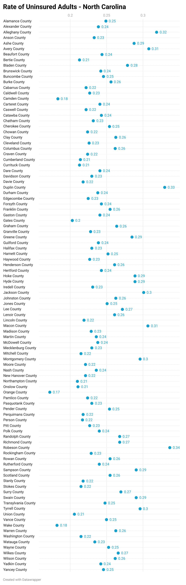

# County Health Data for 2014-2015
This repository was created for Prof. Steven Gotzler's English 105 class in the Spring 2024 semester at the University of North Carolina at Chapel Hill. 
It contains the raw health data for various counties in the United States from the years 2014 to 2015.
It also contains the Python notebook documents how the subsets of data were obtained.

File "ENGL_105Final Project" contains the CoLab Documentation.
# Purpose
The purpose of this respository is to give health data by county. This repository contains filtered data from the original data set "County Public Health Data" to focus on uninsured adults in counties across the state of North Carolina.
# Potential 
The potential for this respository is to allow for analysis and comparison of public health data to aid policymakers and public health officals with their public health decision and policy making. It can also be used to find connections and to identify correlation between categories. The filtered data can be used for specifically North Carolinian lawmakers to make policies on insurance. Replication can change individual variables to allows for different states of interest and different conditions of interest.
# Data Visualization
This visualization was created using Datawrapper. All data is from 2015 and originated from County Public Health Data.

